# Installation Types (Customized vs Standard)

## Standard Installation

The standard installation assumes you would like to take the SharePoint package file located in our GitHub repository and install using the configuration outlined in this readme file (assets all created under a SharePoint site
called TournamentOfTeams as well as the default list names and all related TOT terms within the application)

Continuing below steps you can take the tot.sppkg file from the ***tot.sppkg*** package in ***"sharepoint/solution"*** location of the GitHub repo here (or use the one customized for your organization if someone provided a customized file)

### Deploy your Package to SharePoint

**NOTE:** If you have just created a new tenant please wait for around 15 minutes before starting with the below steps.

1. Open SharePoint and sign in using the administrator account. Click on the "dots" icon in the top left corner of the banner.

    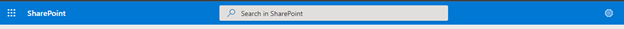 
 
2.	Select Admin from the menu that appears. 

     

3.	Select SharePoint from the menu that appears. You may need to click "... Show all" for the SharePoint entry to appear. 

    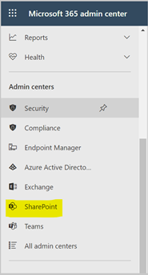 

4.	You will be directed to the SharePoint admin center.

    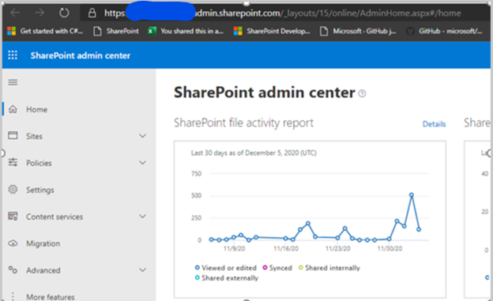 

5.	Click on "More features" menu item. Locate the Apps section and click the ***Open*** button.  

    
 
6.	Click the ***App Catalog*** link. 

    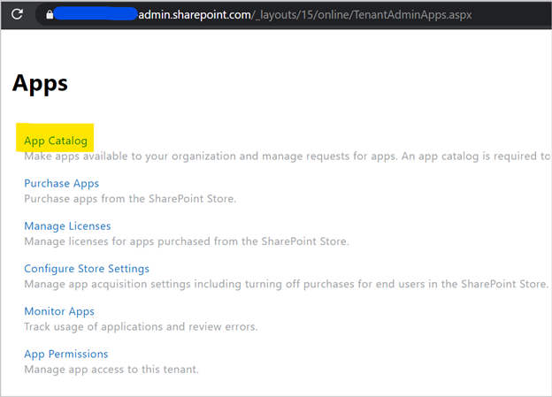 

  *If you do not see an app catalog available, use the instructions <a href='https://docs.microsoft.com/en-us/sharepoint/use-app-catalog#step-1-create-the-app-catalog-site-collection' target="_blank">here</a> to create a new app catalog before continuing.* 

  **NOTE:** If you are using/seeing modern app catalog refer to the go to the [Modern App Catalog](#modern-app-catalog) section.

7.	Click the ***Distribute apps for SharePoint*** link.
 
     

8.	Click the ***New*** menu item 

    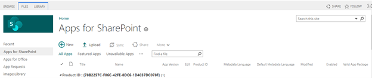 

9.	Click the ***Choose Files*** button, select the ***tot.sppkg*** file you downloaded or created earlier, and click on ***OK***

    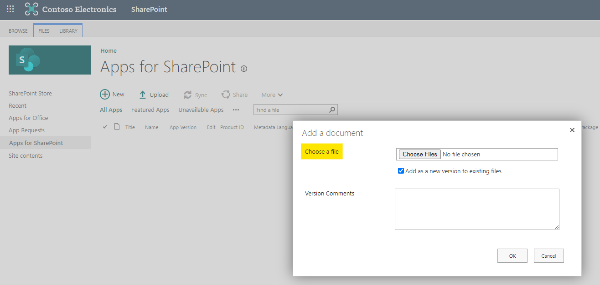 

10.	A confirmation dialog is displayed. Ensure the checkbox for "Make this solution available to all sites in the organization" is chosen and click ***Deploy***.
 
    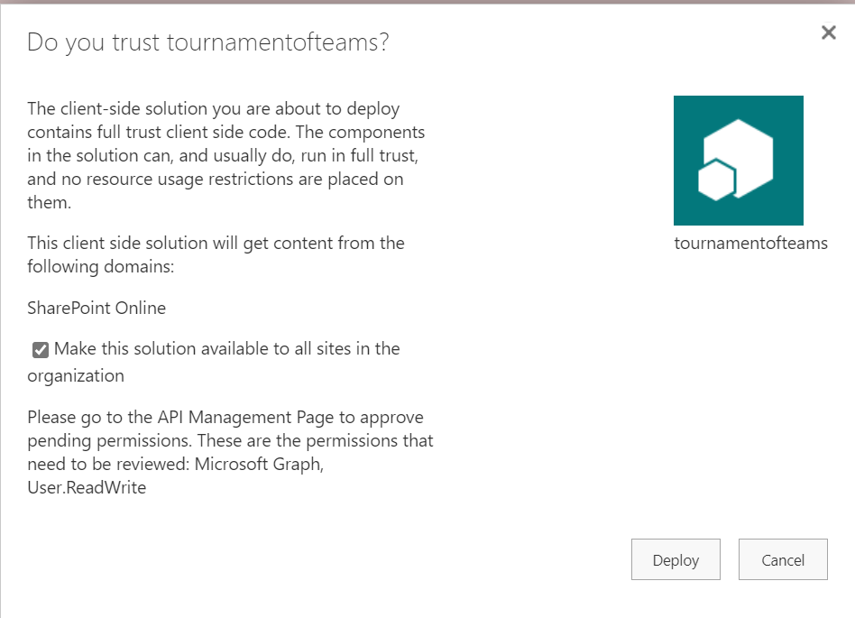 

11.	Return to the ***SharePoint admin center***. Under expand the ***Advanced*** menu in the left navigation and select ***API access***. Select and approve all pending requests associated with ***tournamentsofteams***.

    **User.ReadWrite** : Allows the app to read the signed-in user's full profile. It also allows the app to update the signed-in user's profile information on their behalf. TOT app uses this permission to read and update the user's profile image with the digital badge.
 
    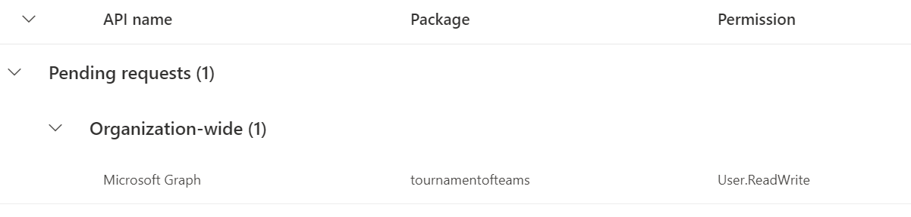 

12.	Return to app list in the App Catalog and select the ***TOT*** app. Select the Files tab in the ribbon and click the ***Sync to Teams*** button.

    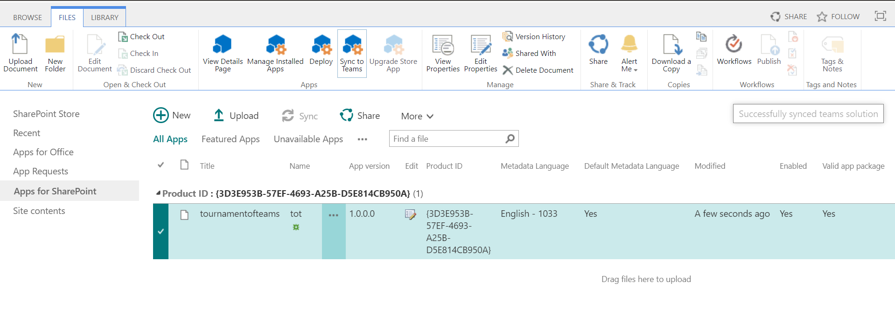

### Modern App Catalog 

``` This section applies only if you are using/seeing modern app catalog.```

1. Click on "Upload" under "Manage Apps" and upload the package file.

    

1. After uploading the package, select "Enable this app and add it to all sites" and click on "Enable App"

    

1. Click on "Go to API access page" to approve the permissions.

    

1. Once done, click on "Add to Teams" to make this app available in Teams

    

## Customized Installation

The customized installation makes the assumption you wish to change the default variables (site location, text or visual aspects, etc) with the TOT Platform. Customizing the installation takes it outside of configurations we have tested against but allows you to modify any aspect of the platform. Below are high level steps to get you started on a customized installation.

### Install NodeJs

1.  Download nodejs from this link 
    https://nodejs.org/ 

2.   Previous Releases | Node.js (nodejs.org) 
    Download node 10.24.0

3.  After downloading the nodejs and installing follow steps as follows

4.  Please open the TOT download folder
    Run Npm install
    And 
    Run npm install -g gulp
    
  *	Global or SharePoint Administrator role in the target tenant
  *	***Tournament Of Teams*** project in GitHub
    
### Customize configuration

If desired the administrator can configure the installation location including the customized site, list, and/or column(s) using following steps:

1.	Update the ***"src/webparts/totHome/provisioning/ProvisioningAssets.json"*** configuration file. Changing the values in the JSON file will customize the SharePoint list location and/or schema when it is created during deployment. If you change list names and columns names, the code must be updated based on your requirements.

    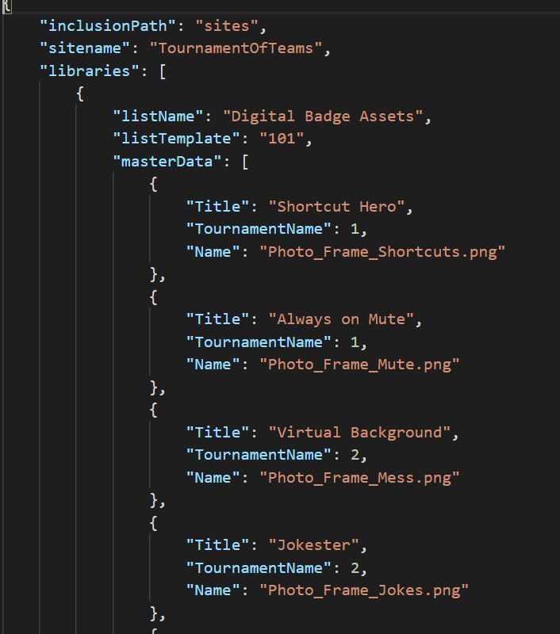

```
· inclusionPath (SharePoint inclusion path - e.g. sites or teams)

· sitename (SharePoint site name)

· libraries (SharePoint document library for Digital Badge Assets)

· lists (SharePoint lists)

**NOTE:** If you change the configuration for libraries/lists/columns in the ProvisioningAssets.json code changes also needs to be done accordingly.

```

2.	Create the SharePoint App Package. This package will be used to deploy the application in SharePoint and Microsoft Teams. Run the below commands :

```
· npm install 

· gulp build

· gulp bundle --ship

· gulp package-solution --ship
```

3.	Navigate to the solution folder where you cloned and locate the newly created ***tot.sppkg*** package in ***"sharepoint/solution"***.

### First Run Experience: Add Tournament of Teams Tab in Teams

**NOTE:** Please wait for around 20 minutes for API access approvals done in the previous section to take effect before proceeding with the below steps.

1.	Navigate to Microsoft teams, select the Team and channel where you want to install Tournament of Teams. Click ***Add a tab***, choose ***Tournament of Teams*** from the app list, and Save (Search for Tournament of Teams)

    Alternately you can also add the Tournament of Teams as a personal app in the left side rail by selecting the “...” and searching for Tournament of Teams, and then selecting add. 
 
    This first run experience needs to be completed by the person who will be an admin of the platform, as it is this experience that creates the initial resources. This user that completes the first run is added as a manager of the platform. Alternately you may need a SharePoint admin to run the first run so the site is created and then have them add you as a manager of the platform once the assets have been created. 

    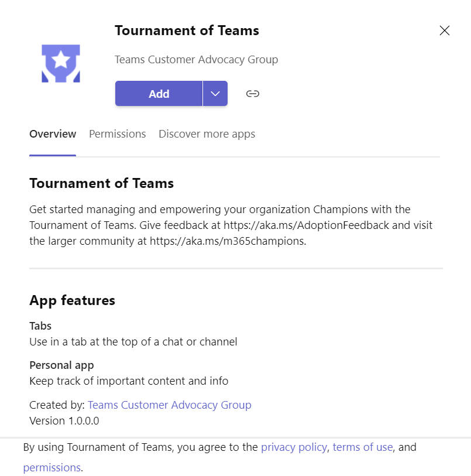 

1. Click 'Add' to create the ***'Tournament of Teams'*** tab to your Teams (Alternately you can also just load the app as a personal app in the left rail here too).
1. After clicking on 'Add', the app will load and you will see a screen as shown below.

    

1. Click on "Enable Tournament of Teams" to activate the setup. After the set up is complete a success message is shown as below. The below snapshot is from Teams in browser. The same message would look different in Teams client.

    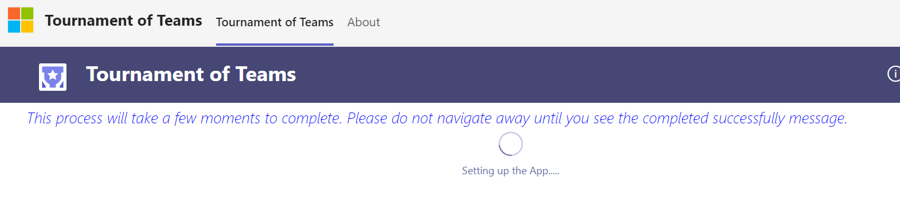

     

1. On refreshing the app, options related to tournaments will be displayed.

    

1. If you still see the spinner message and do not see the success message even after 2 minutes or if you see any error alerts, try clicking on refresh icon on top right. If you see the landing page with all the icons shown in the above picture the app set up is complete.

    If you still do not see the landing page after refresh, please create an issue in the GitHub.

1. The landing page for an Admin will have access to the *Create Tournament, Manage Tournaments, Tournament Reports* and the SharePoint lists (*Actions List, ToT Admins, Digital Badge Assets.
 
    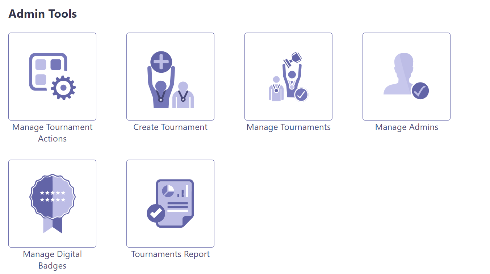

1. Grant Permissions to users:

  - Navigate to the URL for the Tournament of Teams site as the administrator. 

  - If you are using the default configuration, this can be found at ***`https://<yourtenant>.sharepoint.com/sites/TournamentOfTeams/`***.

    - Select site permissions

    - Advanced permissions settings

    - Select Grant permissions 
 
      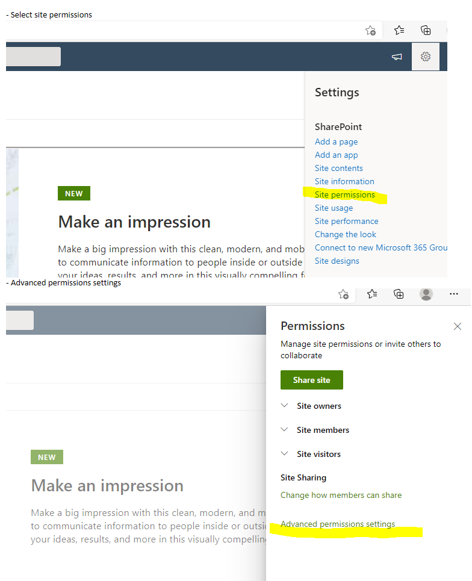

      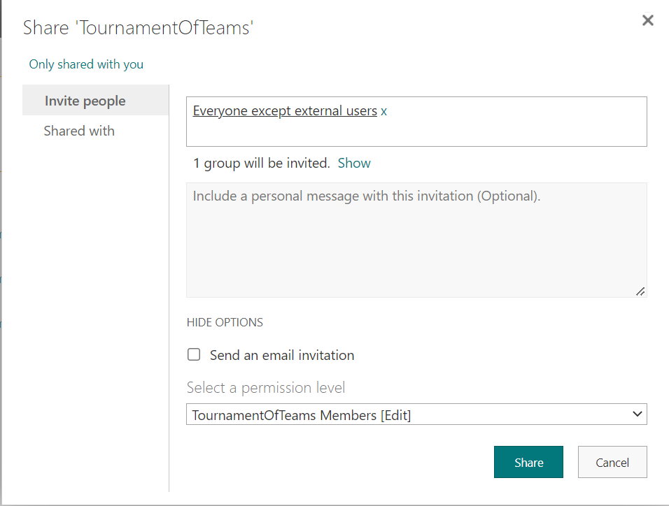

- Select Share
- Enter in 'Everyone except external users'
- Change permissions to Edit
- Unselect send email
- Press share

    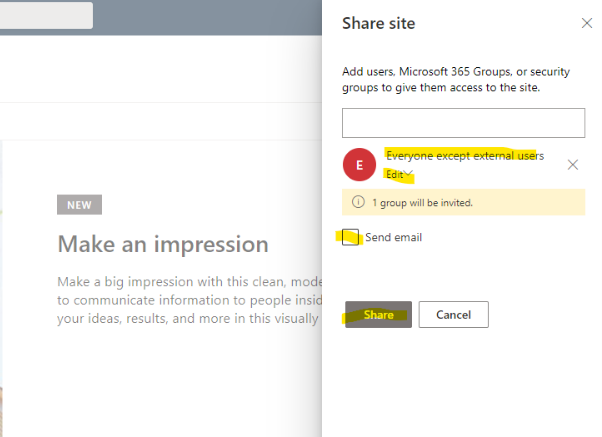 


### Completed Install

Once you have performed the above steps, the deployment of the Tournament Of Teams is now complete. If an admin was deploying this on behalf of the manager of the Tournament Of Teams please have the admin add the Tournament Of Teams manager in "ToT Admins" list so they will have admin access over ToT platform