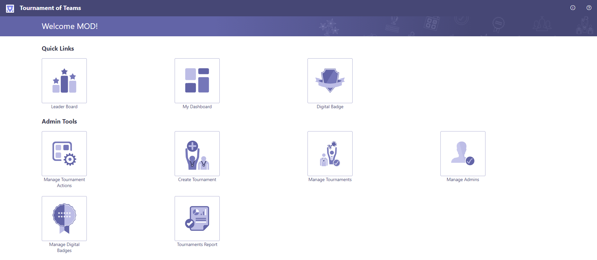

# Tournament of Teams

Tournament of Teams enables the entire organization the gamification and learning experiences of bringing adoption themed tournaments for driving healthy usage. Within the platform you can create and deliver tournaments to help drive healthy usage of scenarios, inspire users by running campaigns prompting new learnings, and track and record tournament actions for post event recognition and impact.

