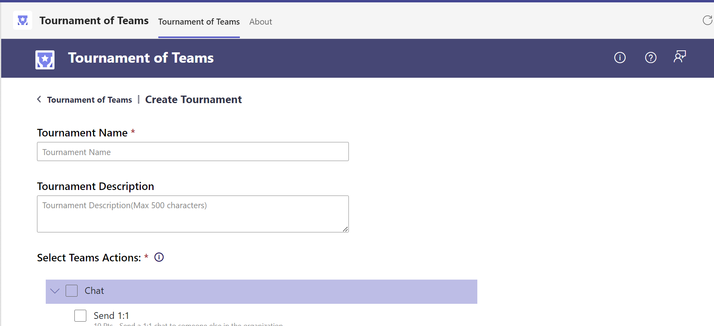
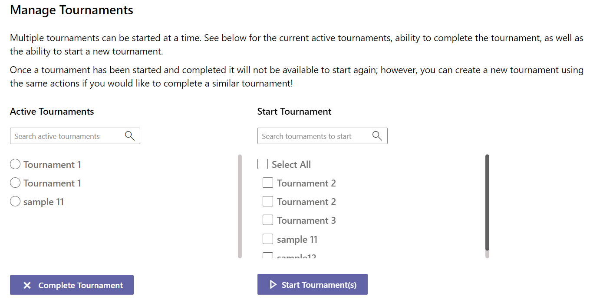

### Enable Tournament of Teams

Tournament of Teams is not enabled by default. Admin needs to enable it from "Enable Tournament of Teams" link when the app is opened for the first time.

 

On enabling "Tournament of Teams": 

1. SharePoint site named "TournamentOfTeams" will be created with below lists/libraries.

> * Digital Badge Assets
> * Actions List
> * App Configuration
> * ToT Admins
> * Tournament Actions
> * Tournaments
> * User Actions
> * Tournaments Report
> * Participants Report

2. The user who enabled “Tournament of Teams” is added to “TOT Admins” list by default. Additional admins can be added directly to the list. 

3. Sample actions, tournaments and tournament badges are added by default.  

### Master Lists

“Manage Tournament Actions”, “Manage Admins”, “Manage Digital Badges” links open the master lists in the SharePoint site. 

Below are the master lists in SharePoint that need to be managed by the TOT Admins:

1. "Actions List" - Sample actions are loaded by default. TOT Admins can add additional actions in the same format as sample data.
2. "TOT Admins" - TOT Admins can add additional admins to this list.
3. "Digital Badge Assets" - Sample badges are loaded to this library by default and tagged to sample tournaments. Admins also can load additional badges and map it to specific tournaments in this list. The tournament specific badges will show up only to the users who have completed that specific tournament.

### Create Tournament

- Admins can create new tournaments by picking the Teams Actions from the list. New Teams Actions need to be added to the “Actions List” in SharePoint. 

 

- Multiple tournaments can also be created by uploading a spreadsheet with tournament details. The sample spread sheet can be downloaded by the users.

 

- Below are the guidelines that need to be followed while creating multiple tournaments using excel template:

    - Do not modify the column headers in the template
    - Do not delete the columns in the template
    - Enter data in all the required(*) columns mentioned in the template
    - Follow the character limit and type mentioned in the template for each column
    - Enter data for only 1 tournament in each sheet as per the sample data provided
    - Only 10 tournaments can be created at a time
    - Ensure the Tournament Name is unique

- Created Tournaments are not started by default. Admin can start the tournament from "Manage Tournaments" screen.

    
### Manage Tournaments 

 - A tournament can be started or completed by an admin using “Manage Tournaments” screen. 

 - Multiple tournaments can be active at a time. 

 - Multiple tournaments can be started at a time

     

### My Dashboard

- Users can start participating in any of the active tournaments using “My Dashboard”.  

- Users can select the tournament from either "My Tournaments" or "Active Tournaments" dropdown list. If a user has participated in any of the active tournaments already they will be listed under "My Tournaments" list. All the other active tournaments will be listed under "Active Tournaments" list.

- “My Dashboard” will show the Teams Actions available in the selected tournament. The users can select the completed actions and save to earn points and a rank in that tournament which is displayed on the left side section of the page. 

- By default, the first tournament in the "My Tournaments" will be selected. If the user has not participated in any of the tournaments yet, first tournament in the "Active Tournaments" will be selected.

- The users must complete at least one action to be considered as a participant in that tournament. The ranks are calculated only among the participants. 

     

### Leaderboard

- Leader board is available to everyone. It shows the list of all participants in the selected active tournament along with their points and ranks. 
- By default, the first tournament in the "My Tournaments" will be selected. If the user has not participated in any of the tournaments yet, first tournament in the "Active Tournaments" will be selected.

     

### Digital Badge

Digital Badge is intended to allow tournament users to apply a digital badge on their profile image. It provides an easy and seamless process to share the recognition as a champion with the team.

 

TOT administrators can upload digital badges and tag it with a specific tournament in the "Digital Badge Assets" library in SharePoint site. Users would have to complete a tournament to earn tournament specific badges. Users can select from multiple badges that they earned, preview the profile picture and apply on their profile picture. 

 

 

### Tournaments Report

- Tournaments Report is available only to admins under "Admin Tools" section.
- Report feature is available only for completed tournaments.
- A report can be viewed for "All Tournaments" or a particular tournament.

 
