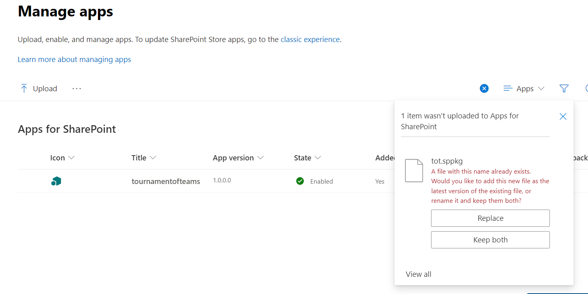

### Upgrade to version 1.1 from 1.0

If you are already having version 1.0 installed on your tenant follow the below steps to upgrade to version 1.1 with an admin account:

 NOTE: The screenshots in this section refer to the Modern App Catalog.

1. Navigate to App Catalog. Do not delete the existing package. Upload the new package that is downloaded from "sharepoint/solution" folder which will replace the existing package.

     

1. After uploading the package, select "Enable this app and add it to all sites" and click on "Enable App"

    

1. Skip this step.

    

1. Once done, click on "Add to Teams" to make this app available in Teams

    

1. Open the app in teams  and you will see the below screen. Click on "Enable Tournament of Teams" to complete the upgrade and the dashboard opens.
    
    

1. The Tournament of Teams Platform will be updated to the latest version and you will see changes reflected in Teams. Please note that if you do not see changes reflected in Teams after 30 minutes you can log out and back in and clear the Teams cache to see changes immediately. 

    